

# CodeIgniter 4 Application Starter

## What is CodeIgniter?

CodeIgniter is a PHP full-stack web framework that is light, fast, flexible and secure.
More information can be found at the [official site](http://codeigniter.com).

This repository holds a composer-installable app starter.
It has been built from the
[development repository](https://github.com/codeigniter4/CodeIgniter4).

More information about the plans for version 4 can be found in [the announcement](http://forum.codeigniter.com/thread-62615.html) on the forums.

The user guide corresponding to this version of the framework can be found
[here](https://codeigniter4.github.io/userguide/).

## Installation & updates

`composer create-project codeigniter4/appstarter` then `composer update` whenever
there is a new release of the framework.

When updating, check the release notes to see if there are any changes you might need to apply
to your `app` folder. The affected files can be copied or merged from
`vendor/codeigniter4/framework/app`.

## Setup

Copy `env` to `.env` and tailor for your app, specifically the baseURL
and any database settings.

## Important Change with index.php

`index.php` is no longer in the root of the project! It has been moved inside the _public_ folder,
for better security and separation of components.

This means that you should configure your web server to "point" to your project's _public_ folder, and
not to the project root. A better practice would be to configure a virtual host to point there. A poor practice would be to point your web server to the project root and expect to enter _public/..._, as the rest of your logic and the
framework are exposed.

**Please** read the user guide for a better explanation of how CI4 works!

## Repository Management

We use GitHub issues, in our main repository, to track **BUGS** and to track approved **DEVELOPMENT** work packages.
We use our [forum](http://forum.codeigniter.com) to provide SUPPORT and to discuss
FEATURE REQUESTS.

This repository is a "distribution" one, built by our release preparation script.
Problems with it can be raised on our forum, or as issues in the main repository.

## Server Requirements

PHP version 7.3 or higher is required, with the following extensions installed:

- [intl](http://php.net/manual/en/intl.requirements.php)
- [libcurl](http://php.net/manual/en/curl.requirements.php) if you plan to use the HTTP\CURLRequest library

Additionally, make sure that the following extensions are enabled in your PHP:

- json (enabled by default - don't turn it off)
- [mbstring](http://php.net/manual/en/mbstring.installation.php)
- [mysqlnd](http://php.net/manual/en/mysqlnd.install.php)
- xml (enabled by default - don't turn it off)

## Praktikum 11

### menjalankan server

1. buka cmd atau git bash, arahkan ke

`cd/xampp/htdocs/lab11_php_ci/ci4`

2. kemudian jalan kan server punya nya codeigniter 4

`php spark serve`

3. buka chrome tulis di URL nya

`localhost:8080`

### ci4

1.  routes

        $routes->get('/', 'Home::index');
        $routes->get('/about', 'Page::about');
        $routes->get('/contact', 'Page::contact');
        $routes->get('/faqs', 'Page::faqs');

2.  controllers

home

        class Home extends BaseController
        {
          public function index()
          {
          return view('home', [
            'title' => 'Home',
            ]);
          }
        }

page

        class page extends BaseController
        {
          public function about()
          {
            return view('about', [
              'title' => 'About',
              ]);
          }
          public function contact()
          {
            return view('contact', [
              'title' => 'Contact',
            ]);
          }
          public function faqs()
          {
            echo "Ini halaman FAQ";
          }
        }

4. header dan footer

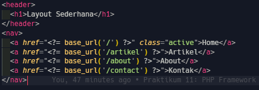

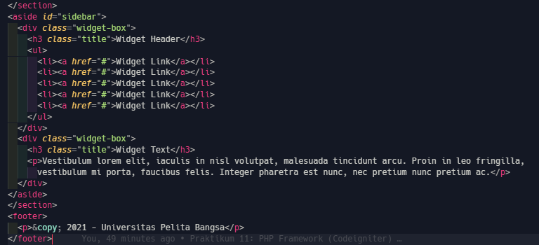

5. tampilan home

untuk mengakses header dan footer kita mggunakan `include`

        <?= $this->include('template/header'); ?>
        <?= $this->include('template/footer'); ?>

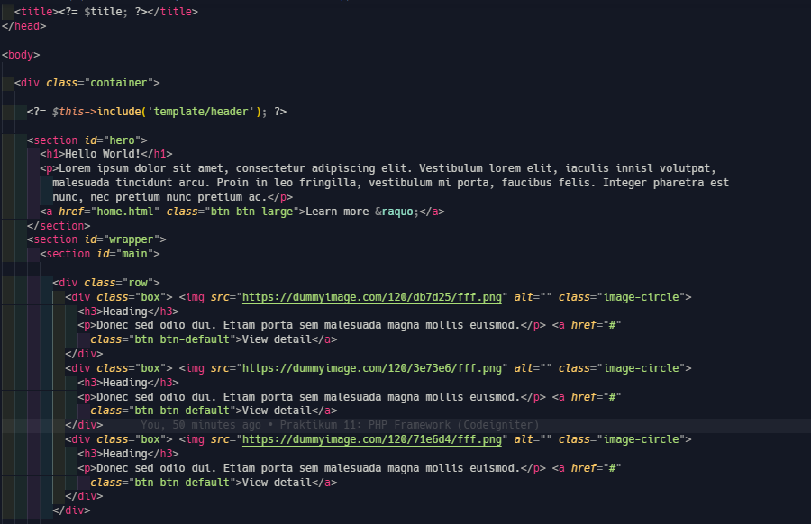

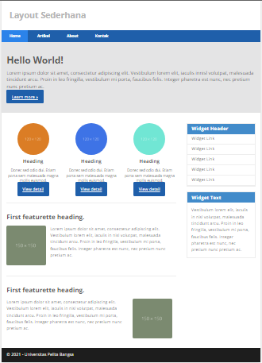

6. tampilan about

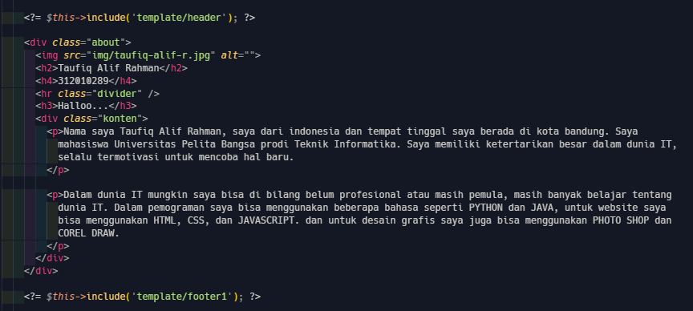

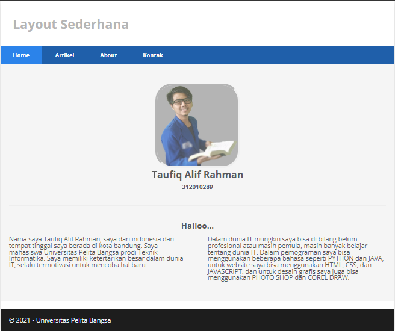

7. tampilan kontak

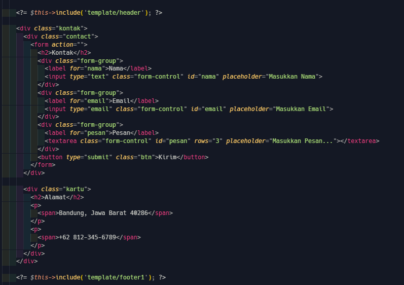

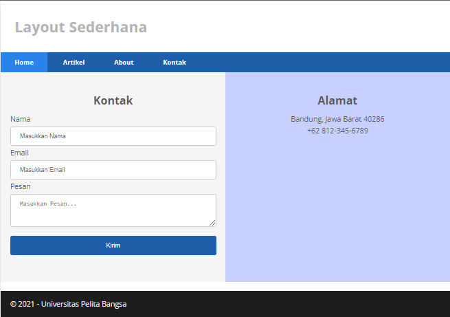

## Lanjutan Praktikum 11 ( CRUD )

1. membuat database

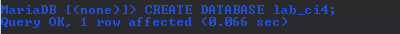

2. membuat table

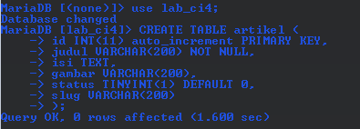

koneksi ke database

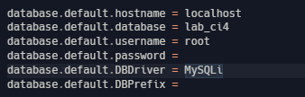

menambahkan routes baru

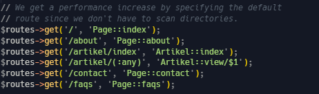

membuat controllers baru

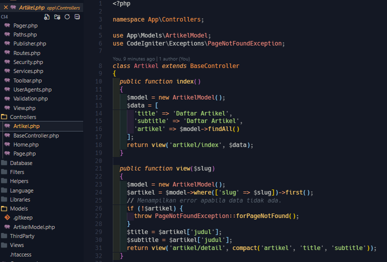

3. membuat tampilan artikel

- pertama kita masukan data terlebih dahulu ke database

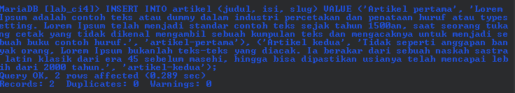

- kemudian membuat folder `artikel` di dalamnya kita bikin file `index.php`

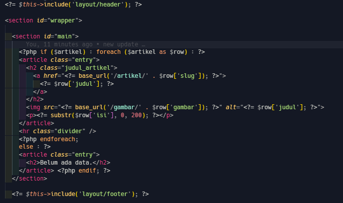

- buka google ketik di URL `localhost:8080` masuk ke artikel

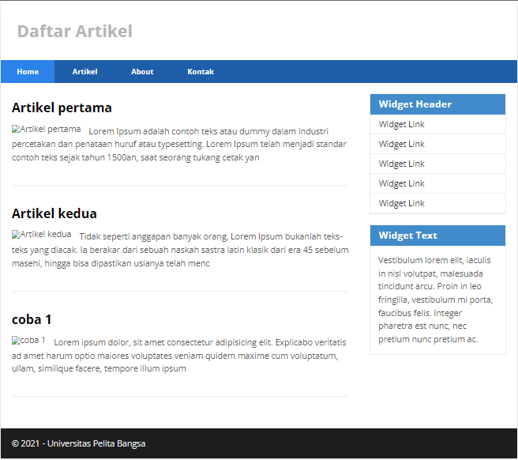
